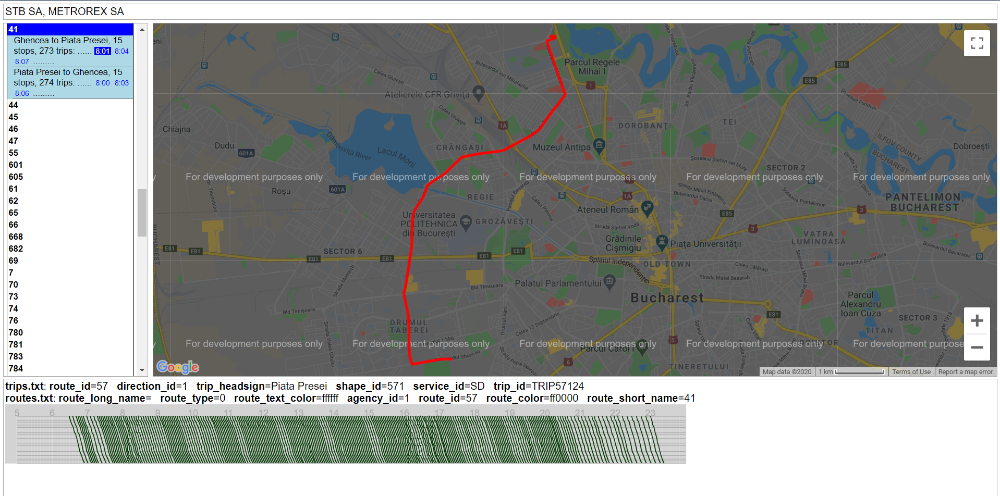
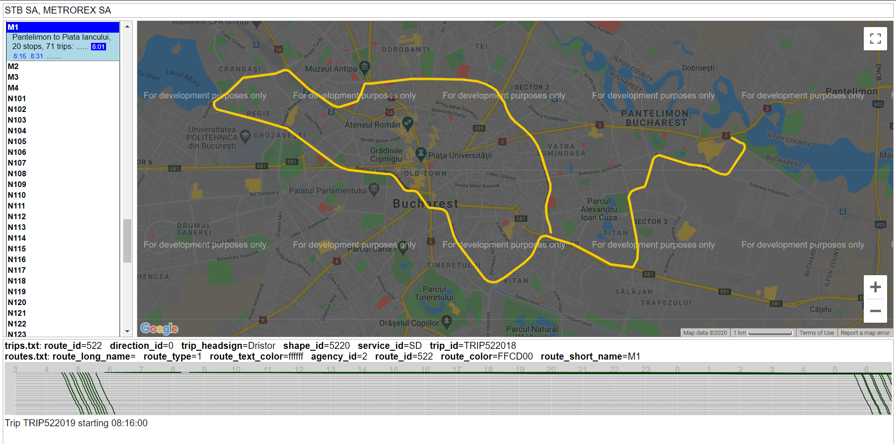
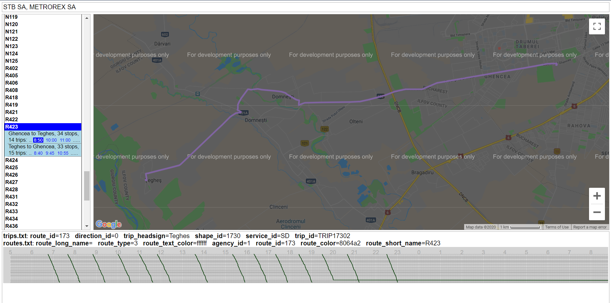
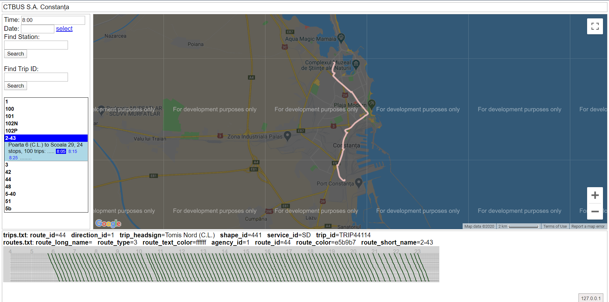
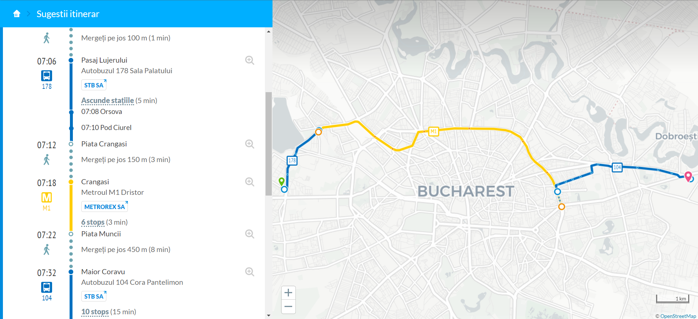
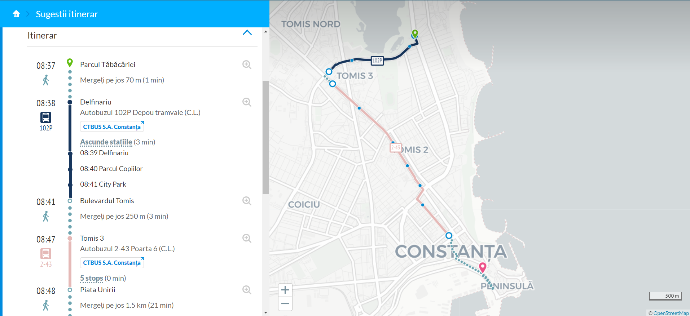

# Bucharest-GTFS-Exporter
Generate GTFS files for transportation modes in Bucharest - STB Bus, Trolleybus, Tram &amp; Metrorex subway. Probably regional bus operators will be soon accessible by this method too.

You need NodeJS v8+ and npm 3+.
- Clone the repo to your computer, switch to its directory, install the dependencies and run.
```sh
$ git clone https://github.com/BodoMinea/Bucharest-GTFS-Exporter.git
$ cd Bucharest-GTFS-Exporter
$ npm install
$ node .
```

It will take a while to run. Randomized artificial delays are introduced in between requests in order to not flood the InfoSTB app servers and defeat potential anti-scrape measures. This whole process took 25 minutes on a Desktop computer with i7 processor and 8gb RAM, with it running from the command line and being the only user process on at that time.

This can be viewed in the [Schedule Viewer that Google provides](https://github.com/google/transitfeed):




### Notes
Given that the API has no way to request the timetable for a specific schedule (calendar) like weekday, weekend and just returns whatever is current for the server's time, you will need to run this in the weekend once and on a weekday once (at least for STB SA and METROREX which have separate schedules only for S/D/Weekdays) and combine your results. All calendars are in the feed, you need to set at line 96:38 when running, what calendar the trips are inserted as. Also, because the app seems to give differently arranged arrays for metro lines, you need to set ```hasMetroLines=true``` in order to properly convert them.

This app will also work to create Constanța GTFS files, you just need to set the API URL on line 7:15 to ```https://info.ctbus.ro``` and ```hasMetroLines=false```. At this time the output is not so exciting because most of the lines do not have static timetables, but you still get your routes, shapes, stops etc. It took just one minute to generate this one on my machine. And you also need to set the agency details on line 14:18, because there is no API to get those currently.



You can even spin up your own OpenTripPlanner instance based on their [basic tutorial](http://docs.opentripplanner.org/en/latest/Basic-Tutorial/) and it will kinda work (the screenshots are not from the basic OTP -anymore- but that would work just fine too):



### Final words
This is a work in progress, please see the attached [Validation Report](https://bodominea.github.io/Bucharest-GTFS-Exporter/validation-results.html). I'm still not sure which ones are project bugs and which are actually bad data entered by the Municipality in the app. Please contribute via PR's if you're able to.
